# Case: A Multi-Agent System for Automated Data Science

> Build, **from scratch**, a small team of cooperating LLM agents that together perform the detailed CRISP-DM cycle on a tabular or text machine-learning problem. The system must be **general** — usable on any Kaggle competition that fits a small configuration schema. To demonstrate that it works, run it end-to-end on three specific competitions chosen for diversity.

---

## What this case asks for

You will build an **agentic system** that takes a problem statement and a dataset and autonomously goes through the full CRISP-DM cycle — including its inner loops — to produce a trained model and a Kaggle-ready submission file. The system is composed of five (optionally six) specialised LLM-driven agents, each owning a part of the cycle and cooperating through a shared state.

A few principles are non-negotiable. The rest is yours to design:

1. **The system is general.** It is not glued to any particular competition. You hand it a small YAML config that says "this is the competition, this is the target column, this is the metric" and the same agent code runs.
2. **You build it from scratch.** No published multi-agent framework (CrewAI, LangGraph, AutoGen, OpenClaw, Hermes Agent, etc.). You write the orchestration, the agent abstractions, the tool layer, and the state model yourself, on top of the OpenAI SDK and a small amount of supporting Python. A working scaffold is provided in [`starter/`](starter/) so you don't reinvent argparse and pydantic — but every interesting line of code is for you to write.
3. **CRISP-DM is the spine.** Not a metaphor — the structure of the 24 generic tasks, the named outputs, and the four loop contours are reflected in the state model, the agent ownership map, and the orchestrator's decision logic.

The deliverable is this repository (MIT-licensed), plus a short paper and an architecture document. The repository will remain public.

## Background: what is a multi-agent system?

A **multi-agent system** (MAS) is a system in which multiple autonomous agents — software entities that perceive their environment, reason about it, and act on it — cooperate to solve a problem no single agent could solve as well alone. The idea predates LLMs by decades, but it has been transformed by them: a modern LLM-based MAS uses one language model (or a small set of them) instantiated multiple times, each instance given a different role, a different set of tools, and a different slice of the shared context.

**Why a multi-agent decomposition can be better than a single big agent.** The same model, instructed to "do everything", typically does each step worse than the same model instructed to do one thing at a time with focused context. Specialisation gives each call:

- A **role-shaped prompt** that primes the model for the right behaviour (a "Data Engineer" is more conservative and code-driven than a free-form assistant).
- A **smaller context window**, which both saves tokens and reduces the cognitive load on the model.
- A **specific toolset** — the modelling agent needs scikit-learn; the project manager doesn't.
- **Separation of doer and checker**, which catches the silent failure mode where a model rationalises its own bad decision.

**The core components of a MAS** are: agents (roles), a shared state or memory, a communication protocol (how messages flow), an orchestration mechanism (who decides what happens next), and tools (what agents can do beyond emit text).

**The risks of a MAS** are real and the team will meet all of them. *Coordination overhead* means a badly-designed multi-agent system is slower and worse than a single well-prompted one. *Hallucination compounding* means an early agent's fabricated column name can poison every downstream call. *Cost blow-up* means a naïve five-agent system can burn 10× the tokens of a single agent for the same task. *Non-termination* means agents can loop forever if the orchestrator doesn't bound them. The case rewards designs that face these risks honestly.

## Background: what is CRISP-DM and what is its philosophy?

**CRISP-DM** (CRoss-Industry Standard Process for Data Mining) is a process model for data mining and data science projects, developed between 1996 and 2000 by a consortium led by SPSS, NCR, Daimler-Chrysler, and OHRA, and published as **CRISP-DM 1.0** in 2000. Despite its age, surveys of working data scientists consistently report it as the most widely used methodology in practice. The reference document defines six **phases**, twenty-four **generic tasks** below them, and named **outputs** for every task — the result is a hierarchical model that is both general enough to apply across industries and specific enough to give a project a real spine.

The six phases are **Business Understanding**, **Data Understanding**, **Data Preparation**, **Modeling**, **Evaluation**, and **Deployment**. The full set of 24 tasks and the loop contours are diagrammed below.

CRISP-DM is more than a checklist. Its **philosophy** is what makes it a good fit for an agentic system:

- **Iterative, not waterfall.** The diagram has back-edges. You are *expected* to return to an earlier phase when a later one reveals you got something wrong. A run that walks `1 → 2 → 3 → 4 → 5 → 6` once without ever firing a back-edge is a script with sections, not a CRISP-DM process. The loops are the point.
- **Business-first and business-last.** The cycle starts with Business Understanding (what is the actual question?) and ends with Deployment (did the answer change anything?). Technical excellence without business framing is not success.
- **Data understanding is its own phase, before preparation.** You investigate what the data actually contains, including its quality flaws, before you decide what to do with it. This is the discipline that catches most beginner mistakes.
- **Outputs are first-class citizens.** Every generic task names a specific output: a Data Description Report, a Test Design, a Model Assessment, an Experience Documentation. These are not optional — they are the artefacts that make a project auditable and a model defensible.
- **Hierarchy, not rigidity.** Phases break into generic tasks; generic tasks break into specialised tasks for your particular project. Specialisation lives at the bottom; structure lives at the top.

CRISP-DM is a natural fit for a multi-agent system because its role separation maps directly onto specialised agents, its 24 named outputs become typed state fields, and its loop contours match the natural error-correction pattern of agentic systems.

## The detailed CRISP-DM reference model

The diagram below is the canonical CRISP-DM 1.0 **Reference Model: Generic Tasks and Outputs** rendered as a flowchart. Bold rows are tasks; italic text is the named outputs each task must produce. The four labelled dotted edges are the canonical loop contours; the Project Manager agent is responsible for firing them when warranted.

```mermaid
flowchart TB
    classDef phase fill:#eef,stroke:#557,stroke-width:1px,color:#113
    classDef task  fill:#fff,stroke:#888,stroke-width:1px,color:#222

    subgraph P1["1. Business Understanding"]
        direction TB
        T11["<b>1.1 Determine Business Objectives</b><br/><i>Background · Business Objectives · Business Success Criteria</i>"]
        T12["<b>1.2 Assess Situation</b><br/><i>Inventory of Resources · Requirements, Assumptions, Constraints · Risks and Contingencies · Terminology · Costs and Benefits</i>"]
        T13["<b>1.3 Determine Data Mining Goals</b><br/><i>Data Mining Goals · Data Mining Success Criteria</i>"]
        T14["<b>1.4 Produce Project Plan</b><br/><i>Project Plan · Initial Assessment of Tools and Techniques</i>"]
        T11 --> T12 --> T13 --> T14
    end

    subgraph P2["2. Data Understanding"]
        direction TB
        T21["<b>2.1 Collect Initial Data</b><br/><i>Initial Data Collection Report</i>"]
        T22["<b>2.2 Describe Data</b><br/><i>Data Description Report</i>"]
        T23["<b>2.3 Explore Data</b><br/><i>Data Exploration Report</i>"]
        T24["<b>2.4 Verify Data Quality</b><br/><i>Data Quality Report</i>"]
        T21 --> T22 --> T23 --> T24
    end

    subgraph P3["3. Data Preparation"]
        direction TB
        T31["<b>3.1 Select Data</b><br/><i>Rationale for Inclusion / Exclusion</i>"]
        T32["<b>3.2 Clean Data</b><br/><i>Data Cleaning Report</i>"]
        T33["<b>3.3 Construct Data</b><br/><i>Derived Attributes · Generated Records</i>"]
        T34["<b>3.4 Integrate Data</b><br/><i>Merged Data</i>"]
        T35["<b>3.5 Format Data</b><br/><i>Reformatted Data · Dataset · Dataset Description</i>"]
        T31 --> T32 --> T33 --> T34 --> T35
    end

    subgraph P4["4. Modeling"]
        direction TB
        T41["<b>4.1 Select Modeling Technique</b><br/><i>Modeling Technique · Modeling Assumptions</i>"]
        T42["<b>4.2 Generate Test Design</b><br/><i>Test Design</i>"]
        T43["<b>4.3 Build Model</b><br/><i>Parameter Settings · Models · Model Descriptions</i>"]
        T44["<b>4.4 Assess Model</b><br/><i>Model Assessment · Revised Parameter Settings</i>"]
        T41 --> T42 --> T43 --> T44
    end

    subgraph P5["5. Evaluation"]
        direction TB
        T51["<b>5.1 Evaluate Results</b><br/><i>Assessment of Data Mining Results w.r.t. Business Success Criteria · Approved Models</i>"]
        T52["<b>5.2 Review Process</b><br/><i>Review of Process</i>"]
        T53["<b>5.3 Determine Next Steps</b><br/><i>List of Possible Actions · Decision</i>"]
        T51 --> T52 --> T53
    end

    subgraph P6["6. Deployment"]
        direction TB
        T61["<b>6.1 Plan Deployment</b><br/><i>Deployment Plan</i>"]
        T62["<b>6.2 Plan Monitoring and Maintenance</b><br/><i>Monitoring and Maintenance Plan</i>"]
        T63["<b>6.3 Produce Final Report</b><br/><i>Final Report · Final Presentation</i>"]
        T64["<b>6.4 Review Project</b><br/><i>Experience Documentation</i>"]
        T61 --> T62 --> T63 --> T64
    end

    P1  ==> P2
    P2 -. "loop A: 2 → 1<br/>data contradicts the<br/>stated business goal" .-> P1
    P2  ==> P3
    P3  ==> P4
    P4 -. "loop B: 4 → 3<br/>modeling reveals new<br/>preparation needs" .-> P3
    P4  ==> P5
    P5 -. "loop C: 5 → 1<br/>business success criterion<br/>not met" .-> P1
    P5  ==> P6
    P6 -. "loop D: 6 → 1<br/>outer cycle / lessons<br/>for the next run" .-> P1

    class P1,P2,P3,P4,P5,P6 phase
    class T11,T12,T13,T14,T21,T22,T23,T24,T31,T32,T33,T34,T35,T41,T42,T43,T44,T51,T52,T53,T61,T62,T63,T64 task
```

The four loop contours, as a checklist the Project Manager must implement:

| Loop | Trigger | Action |
|---|---|---|
| **A — 2 → 1** | Data Quality Report lists blockers, or Domain Expert's hypotheses are contradicted by the actual schema | Return to 1.3 (Data Mining Goals); refine objectives and re-enter Phase 2 |
| **B — 4 → 3** | Model Assessment flags a specific preparation deficit (e.g. weak text representation, missing engineered feature) | Return to the affected substep of Phase 3; cap at three iterations |
| **C — 5 → 1** | Evaluate Results says Business Success Criteria are not met | Return to 1.3; if A has already fired twice, halt with "infeasible under current goals" |
| **D — 6 → 1** | After 6.4 Review Project; the Experience Documentation feeds the next run | Optional outer cycle; supports cross-dataset learning |

## The five agents

| Agent | Owns | Shares with |
|---|---|---|
| **Project Manager** | Phase transitions and all four loop contours. Decides when a phase is "done enough" and when to fire a back-edge. Owns 1.4 (Project Plan), 5.2 (Review Process), 5.3 (Determine Next Steps). | — |
| **Domain Knowledge Expert** | Full Business Understanding (1.1, 1.2, 1.3). Contributes to Data Understanding (2.1, 2.2, 2.3). Owns the RAG corpus. | Data Engineer (on 2.x) |
| **Data Engineer** | Full Data Understanding except 2.3 (which is the Data Scientist's modelling-lens exploration). Full Data Preparation (3.1–3.5). | Domain Expert (on 2.x); Data Scientist (on 2.3) |
| **Data Scientist** | Modelling-lens contribution to 2.3 (Explore Data). Full Modeling (4.1–4.4). Validation responsibilities in 4.4 and 5.1 (unless a separate Validator is introduced). | Data Engineer (on 2.3); Developer (on 4.3) |
| **Developer** | Cross-cutting: implements whatever tooling other agents need, and **owns debugging** when their code fails. Full Deployment (6.1–6.4). | All others |

If the team prefers a sixth, **independent Validator** agent — owning 4.4 and 5.1 separately from the Data Scientist — that is a defensible variant. Either way, defend the choice in the architecture document.

### The Developer's debugging responsibility

Agentic ML systems fail in characteristic ways: an agent emits code that references a column the data doesn't contain, a sklearn Pipeline raises a shape mismatch, a JSON output fails to parse, a `PythonExec` call times out. The Developer is the **on-call debugger** for all of this. Its toolkit should include, at a minimum:

- **Stack-trace analysis** — when `PythonExec` returns a non-zero exit code, the Developer reads the stderr, classifies the error (schema, type, leakage, library version, OOM, timeout), and proposes a fix.
- **Schema verification** — given a code snippet that touches a DataFrame, check that every column referenced is in the actual schema reported by 2.2.
- **Iterative re-execution** — re-run the failed code with the proposed fix, capture the new result, repeat up to a bounded number of attempts.
- **Output-format repair** — when an agent's JSON output fails to validate against the expected schema, the Developer produces a corrected version rather than dropping the entire call.
- **Bisection / minimal reproduction** — when a pipeline produces wrong-looking numbers, narrow down the offending step rather than re-running the whole pipeline.

Treat the Developer as the agent that keeps the rest of the agents from drowning in their own errors. Without it, every other agent has to handle errors itself, and that responsibility spreads thinly.

## No framework. Build it from primitives.

You will not use CrewAI, LangGraph, AutoGen, OpenClaw, Hermes Agent, or any other published multi-agent framework. The educational point of the case is that you build the orchestration yourself and *understand every line of it*.

In practice:

- The **only LLM library** you need is the official `openai` Python SDK.
- You write your own **`Agent` base class** (the [`starter/`](starter/) scaffold has the empty class waiting).
- You write your own **orchestrator / state machine** that walks the 24 substeps and fires the four loops.
- You write your own **tool layer** — at minimum a Python execution sandbox, file IO, and a simple RAG retriever. The Python sandbox is included in the scaffold; the rest is on you.
- You write your own **shared state model** (the scaffold gives you a full pydantic skeleton matching the 24 CRISP-DM outputs).
- Standard scientific-Python libraries are fair game: `pandas`, `numpy`, `scikit-learn`, `xgboost`, `lightgbm`, `catboost`, `pydantic`, `pyyaml`, `tiktoken`, plus your choice of vector index.

See [`docs/ARCHITECTURE.md`](docs/ARCHITECTURE.md) for the suggested design in depth.

## Token economy is a first-class concern

A naïve multi-agent system burns tokens. With 5 agents, 24 substeps, and 4 loops, the call graph can easily explode. Treating tokens as cheap will cost the team the API budget early. **Read [`docs/TOKEN_BUDGET.md`](docs/TOKEN_BUDGET.md) before writing your first agent.** It covers prompt caching, context compression, retrieval-based memory, model tiering, output capping, log truncation, schema-not-data prompting, and other techniques the team must use from the start.

## LLM backend

Use **OpenAI as the default** backend. Suggested routing:

| Agent | Suggested model tier | Reason |
|---|---|---|
| Project Manager | top-tier reasoning model | Planning + loop-firing decisions are the highest-stakes calls. |
| Validator (if used) | top-tier reasoning model | Adversarial reasoning. |
| Data Scientist | top-tier or mid-tier | Modelling decisions benefit from reasoning. |
| Domain Expert | mid-tier | Largely RAG-grounded; doesn't need top reasoning. |
| Data Engineer | mid-tier | Mostly code generation against a known schema. |
| Developer | mid-tier | Code generation, packaging, debugging. |

### Using DeepSeek as a cost-effective fallback

**DeepSeek** is a fully supported alternative for any agent whose calls are high-volume or code-heavy — typically the Data Engineer, the Developer (when debugging at scale), and parts of the Data Scientist's workflow. DeepSeek's `deepseek-chat` (DeepSeek-V3) is roughly an order of magnitude cheaper on input tokens than GPT-4-class models with competitive performance on coding and tabular reasoning; `deepseek-reasoner` (DeepSeek-R1) is the reasoning variant — use it for the harder planning calls if you don't want to spend OpenAI tokens there.

The DeepSeek API is OpenAI-compatible (same request/response shape, different base URL), so the scaffold's `llm.py` supports both providers behind one interface. Set `DEEPSEEK_API_KEY` in `.env` and either:

- **Route per-agent**: e.g. PM and Validator on OpenAI, all others on DeepSeek. Edit `llm_for(agent_name)` in `maads/llm.py`.
- **Route per-task**: have the PM call OpenAI but ask the Developer to call DeepSeek for routine code generation, falling back to OpenAI only when DeepSeek fails to produce working code.
- **Route by phase**: top-tier model in Phases 1 and 5 (the most reasoning-heavy), cheaper model in Phases 2–4.

Log token spend per agent *and per provider* from the start. The cost analysis is one of the most interesting findings the paper can report.

## Demonstration suite: three Kaggle competitions

The system is **general**. To demonstrate that, this case requires running it on three specific Kaggle competitions, chosen for diversity along the axes that matter for an agentic data science system:

| # | Competition | Problem type | Data type |
|---|---|---|---|
| 1 | [Titanic — Machine Learning from Disaster](https://www.kaggle.com/competitions/titanic) | Binary classification | Tabular, mixed (numeric + categorical + free text) |
| 2 | [House Prices — Advanced Regression Techniques](https://www.kaggle.com/competitions/house-prices-advanced-regression-techniques) | Regression | Tabular, 79 features, heavy on engineered ordinals |
| 3 | [Natural Language Processing with Disaster Tweets](https://www.kaggle.com/competitions/nlp-getting-started) | Binary classification | Text (NLP) |

The same agent code runs all three: only a small YAML config differs between runs. Score targets, baselines, and per-dataset notes are in [`docs/DATASETS.md`](docs/DATASETS.md).

Adding a **fourth or fifth Kaggle competition** should be as easy as writing a config file and running one command. The scaffold's CLI and config loader are designed for exactly that — there is no enumerated list of supported competitions. See [`docs/DATASETS.md`](docs/DATASETS.md) for the schema and [`starter/configs/`](starter/configs/) for examples.

## What success looks like

The deliverable is judged informally on the following, which we list to make expectations concrete — not as a scoreboard:

- The system runs end-to-end from a single command, on at least one of the three demonstration competitions, with no human intervention after launch.
- The system runs on all three demonstration competitions without dataset-specific agent code (only the config differs).
- The five (or six) agents are observable in the logs — you can see which agent is active in which CRISP-DM substep at any moment.
- At least one of the four loop contours fires on at least one of the three runs, *when it should*, and the system recovers correctly.
- Submissions are Kaggle-valid (right schema, dtypes, row count) and beat the trivial baseline on each competition the system attempts.
- The architecture document defends the major design choices: why these agents, why this state shape, why this orchestrator pattern.
- Token spend per agent is logged and reported. The system does not melt the budget.
- A reproducibility appendix shows that a fresh checkout runs the same pipelines and produces submissions in the same shape.
- The paper situates the work against prior automated-data-science systems and reports honest results, including what didn't work.

A solution that hits even two-thirds of these is a worthy submission.

## Deliverables

1. **A working multi-agent system** in this repository, runnable end-to-end on any of the three demonstration competitions with a single command.
2. **Submission files** (`submission.csv`) for each of the three competitions you ran the system on, plus the public-leaderboard scores observed.
3. **An architecture document** — diagram, agents, tools, prompts, state shape, loop logic, and an honest log of failure modes hit and fixed. See [`docs/ARCHITECTURE.md`](docs/ARCHITECTURE.md) for what to include.
4. **A short paper** (4–8 pages, conference-style structure: abstract, introduction, related work, method, results, discussion, references).

## Getting started

1. Read this README and the four supporting docs in [`docs/`](docs/). `TOKEN_BUDGET.md` first if cost is the main concern; `ARCHITECTURE.md` first if you want to dive into the design; `DATASETS.md` to learn the demonstration suite; `RESOURCES.md` for background reading.
2. Open the scaffold in [`starter/`](starter/) and read its own `README.md`. It already runs — it just doesn't do anything useful yet.
3. Pin the team's design decisions early. Don't deliberate forever — disagreement on framework choice will eat more time than any framework.
4. Get one agent end-to-end on Titanic before adding the next. Working > complete.

## License

[MIT](LICENSE). The repository will remain public.
