# Case: A Multi-Agent System for Automated Data Science

> Build a small team of cooperating LLM agents that together work through CRISP-DM on real Kaggle problems. **Use a mature multi-agent framework** — your time is best spent on agent design, prompts, the CRISP-DM mapping, and experimental results, not on rebuilding orchestration plumbing that already exists.

---

## What this case asks for

You will assemble an agentic system that takes a problem statement and a dataset and walks through the full CRISP-DM cycle — including its inner loops — to produce a trained model and a Kaggle-ready submission. The system is composed of five specialised LLM-driven agents, each owning a part of the cycle and cooperating through a shared context.

This is a case about **applying** agentic AI to a structured data-science process. You are studying AI application; you are not being asked to engineer agentic infrastructure from first principles. Pick a mature framework, harness its abstractions, and put your effort into the things that actually matter for this problem:

- **Agent design** — what each role is responsible for, what context it needs, which tools it gets.
- **Prompt engineering** — system prompts and task descriptions that produce useful, structured outputs.
- **CRISP-DM mapping** — translating the 24 substeps and four loop contours into agent invocations and back-edges.
- **Token economy** — keeping each run cheap enough to iterate on.
- **Empirical results** — how the system actually performs on three diverse Kaggle problems.

A small `starter/` directory provides utilities (config loading, Kaggle data download, a Python sandbox tool, a typed CRISP-DM state model) you can drop into whichever framework you pick. The rest is yours to choose.

The deliverable is this repository (MIT-licensed), plus a short paper and an architecture document. The repository will remain public.

## Background: what is a multi-agent system?

A **multi-agent system** (MAS) is a system in which multiple autonomous agents — software entities that perceive their environment, reason about it, and act on it — cooperate to solve a problem no single agent could solve as well alone. The idea predates LLMs by decades, but it has been transformed by them: a modern LLM-based MAS uses one language model (or a small set) instantiated multiple times, each instance given a different role, a different set of tools, and a different slice of shared context.

**Why a multi-agent decomposition can be better than a single big agent.** The same model, instructed to "do everything", typically does each step worse than the same model instructed to do one thing at a time with focused context. Specialisation gives each call a role-shaped prompt that primes the model for the right behaviour, a smaller context window that saves tokens and reduces cognitive load, a specific toolset matched to the task, and — crucially — separation of "doer" from "checker", which catches the silent failure mode where a model rationalises its own bad decision.

**The core components of any MAS** are: agents (roles), a shared state or memory, a communication protocol (how messages flow), an orchestration mechanism (who decides what happens next), and tools (what agents can do beyond emit text). Frameworks like CrewAI and LangGraph give you all five out of the box; your job in this case is to *design* what fills those slots, not to *implement* the slots.

**The risks of a MAS** are real and you will meet them. *Coordination overhead* — a badly-designed multi-agent system is slower and worse than a single well-prompted one. *Hallucination compounding* — an early agent's fabricated column name can poison every downstream call. *Cost blow-up* — every agent call costs tokens; naïve systems explode in cost. *Non-termination* — agents can loop forever if the orchestrator doesn't bound them. The case rewards designs that face these risks honestly.

## Background: what is CRISP-DM and what is its philosophy?

**CRISP-DM** (CRoss-Industry Standard Process for Data Mining) is a process model for data-mining and data-science projects, developed between 1996 and 2000 by a consortium led by SPSS, NCR, Daimler-Chrysler, and OHRA, and published as **CRISP-DM 1.0** in 2000. Despite its age, surveys of working data scientists consistently report it as the most widely used methodology in practice. The reference document defines six **phases**, twenty-four **generic tasks** below them, and named **outputs** for every task — a hierarchical model that is both general enough to apply across industries and specific enough to give a project a real spine.

The six phases are **Business Understanding**, **Data Understanding**, **Data Preparation**, **Modeling**, **Evaluation**, and **Deployment**. The full set of 24 tasks and the loop contours are diagrammed below.

CRISP-DM is more than a checklist. Its **philosophy** is what makes it a natural fit for an agentic system:

- **Iterative, not waterfall.** The diagram has back-edges. You are *expected* to return to an earlier phase when a later one reveals you got something wrong. A system that walks `1 → 2 → 3 → 4 → 5 → 6` once without ever firing a back-edge is a script with sections, not a CRISP-DM process. The loops are the point.
- **Business-first and business-last.** The cycle starts with Business Understanding (what is the actual question?) and ends with Deployment (did the answer change anything?). Technical excellence without business framing is not success.
- **Data understanding is its own phase, before preparation.** You investigate what the data actually contains, including its quality flaws, before you decide what to do with it. This is the discipline that catches most beginner mistakes.
- **Outputs are first-class citizens.** Every generic task names a specific output: a Data Description Report, a Test Design, a Model Assessment, an Experience Documentation. These are the artefacts that make a project auditable.
- **Hierarchy, not rigidity.** Phases break into generic tasks; generic tasks break into specialised tasks for your particular project. Structure at the top, specialisation at the bottom.

CRISP-DM maps naturally onto multi-agent design because its role separation maps onto specialised agents, its 24 named outputs become typed state fields, and its loop contours match the natural error-correction pattern of agentic systems.

## The detailed CRISP-DM reference model

The diagram below is the canonical CRISP-DM 1.0 **Reference Model: Generic Tasks and Outputs** rendered as a flowchart. Bold rows are tasks; italic text is the named outputs each task must produce. The four labelled dotted edges are the canonical loop contours; the Project Manager agent is responsible for firing them when warranted.

```mermaid
flowchart TB
    classDef phase fill:#eef,stroke:#557,stroke-width:1px,color:#113
    classDef task  fill:#fff,stroke:#888,stroke-width:1px,color:#222

    subgraph P1["1. Business Understanding"]
        direction TB
        T11["<b>1.1 Determine Business Objectives</b><br/><i>Background · Business Objectives · Business Success Criteria</i>"]
        T12["<b>1.2 Assess Situation</b><br/><i>Inventory of Resources · Requirements, Assumptions, Constraints · Risks and Contingencies · Terminology · Costs and Benefits</i>"]
        T13["<b>1.3 Determine Data Mining Goals</b><br/><i>Data Mining Goals · Data Mining Success Criteria</i>"]
        T14["<b>1.4 Produce Project Plan</b><br/><i>Project Plan · Initial Assessment of Tools and Techniques</i>"]
        T11 --> T12 --> T13 --> T14
    end

    subgraph P2["2. Data Understanding"]
        direction TB
        T21["<b>2.1 Collect Initial Data</b><br/><i>Initial Data Collection Report</i>"]
        T22["<b>2.2 Describe Data</b><br/><i>Data Description Report</i>"]
        T23["<b>2.3 Explore Data</b><br/><i>Data Exploration Report</i>"]
        T24["<b>2.4 Verify Data Quality</b><br/><i>Data Quality Report</i>"]
        T21 --> T22 --> T23 --> T24
    end

    subgraph P3["3. Data Preparation"]
        direction TB
        T31["<b>3.1 Select Data</b><br/><i>Rationale for Inclusion / Exclusion</i>"]
        T32["<b>3.2 Clean Data</b><br/><i>Data Cleaning Report</i>"]
        T33["<b>3.3 Construct Data</b><br/><i>Derived Attributes · Generated Records</i>"]
        T34["<b>3.4 Integrate Data</b><br/><i>Merged Data</i>"]
        T35["<b>3.5 Format Data</b><br/><i>Reformatted Data · Dataset · Dataset Description</i>"]
        T31 --> T32 --> T33 --> T34 --> T35
    end

    subgraph P4["4. Modeling"]
        direction TB
        T41["<b>4.1 Select Modeling Technique</b><br/><i>Modeling Technique · Modeling Assumptions</i>"]
        T42["<b>4.2 Generate Test Design</b><br/><i>Test Design</i>"]
        T43["<b>4.3 Build Model</b><br/><i>Parameter Settings · Models · Model Descriptions</i>"]
        T44["<b>4.4 Assess Model</b><br/><i>Model Assessment · Revised Parameter Settings</i>"]
        T41 --> T42 --> T43 --> T44
    end

    subgraph P5["5. Evaluation"]
        direction TB
        T51["<b>5.1 Evaluate Results</b><br/><i>Assessment of Data Mining Results w.r.t. Business Success Criteria · Approved Models</i>"]
        T52["<b>5.2 Review Process</b><br/><i>Review of Process</i>"]
        T53["<b>5.3 Determine Next Steps</b><br/><i>List of Possible Actions · Decision</i>"]
        T51 --> T52 --> T53
    end

    subgraph P6["6. Deployment"]
        direction TB
        T61["<b>6.1 Plan Deployment</b><br/><i>Deployment Plan</i>"]
        T62["<b>6.2 Plan Monitoring and Maintenance</b><br/><i>Monitoring and Maintenance Plan</i>"]
        T63["<b>6.3 Produce Final Report</b><br/><i>Final Report · Final Presentation</i>"]
        T64["<b>6.4 Review Project</b><br/><i>Experience Documentation</i>"]
        T61 --> T62 --> T63 --> T64
    end

    P1  ==> P2
    P2 -. "loop A: 2 → 1<br/>data contradicts the<br/>stated business goal" .-> P1
    P2  ==> P3
    P3  ==> P4
    P4 -. "loop B: 4 → 3<br/>modeling reveals new<br/>preparation needs" .-> P3
    P4  ==> P5
    P5 -. "loop C: 5 → 1<br/>business success criterion<br/>not met" .-> P1
    P5  ==> P6
    P6 -. "loop D: 6 → 1<br/>outer cycle / lessons<br/>for the next run" .-> P1

    class P1,P2,P3,P4,P5,P6 phase
    class T11,T12,T13,T14,T21,T22,T23,T24,T31,T32,T33,T34,T35,T41,T42,T43,T44,T51,T52,T53,T61,T62,T63,T64 task
```

The four loop contours, as a checklist the Project Manager must implement:

| Loop | Trigger | Action |
|---|---|---|
| **A — 2 → 1** | Data Quality Report lists blockers, or Domain Expert's hypotheses are contradicted by the actual schema | Return to 1.3 (Data Mining Goals); refine objectives and re-enter Phase 2 |
| **B — 4 → 3** | Model Assessment flags a specific preparation deficit | Return to the affected substep of Phase 3; cap at three iterations |
| **C — 5 → 1** | Evaluate Results says Business Success Criteria are not met | Return to 1.3; halt if Loop A has already fired twice |
| **D — 6 → 1** | After 6.4 Review Project; the Experience Documentation feeds the next run | Optional outer cycle; supports cross-dataset learning |

## The five agents

| Agent | Owns | Shares with |
|---|---|---|
| **Project Manager** | Phase transitions and all four loop contours. Decides when a phase is "done enough" and when to fire a back-edge. Owns 1.4 (Project Plan), 5.2 (Review Process), 5.3 (Determine Next Steps). | — |
| **Domain Knowledge Expert** | Full Business Understanding (1.1, 1.2, 1.3). Contributes to Data Understanding (2.1, 2.2, 2.3). Owns the RAG corpus. | Data Engineer (on 2.x) |
| **Data Engineer** | Full Data Understanding except 2.3. Full Data Preparation (3.1–3.5). | Domain Expert (on 2.x); Data Scientist (on 2.3) |
| **Data Scientist** | Modelling-lens contribution to 2.3 (Explore Data). Full Modeling (4.1–4.4). Validation in 4.4 and 5.1, unless a separate Validator is introduced. | Data Engineer (on 2.3); Developer (on 4.3) |
| **Developer** | Cross-cutting: implements whatever tooling other agents need, and **handles debugging** when their code fails. Full Deployment (6.1–6.4). | All others |

If the team prefers a sixth, **independent Validator** agent — owning 4.4 and 5.1 separately from the Data Scientist — that is a defensible variant. Either way, defend the choice in the architecture document.

The Developer is worth special attention. Agentic ML systems fail in characteristic ways — an agent emits code referencing a column that doesn't exist, a sklearn Pipeline raises a shape mismatch, a JSON output fails to parse. The Developer is the **on-call debugger** for all of this: classifying the error, proposing a fix, re-executing under a small retry budget, repairing malformed agent outputs. In a framework, this is typically a regular agent with the right toolset (a Python executor, a schema checker, a JSON-repair helper) and a prompt focused on "diagnose-then-fix" behaviour. Treat the Developer as the agent that keeps the rest of the agents from drowning in their own errors.

## Choose a framework

This case explicitly **encourages using a multi-agent framework**. You are studying AI application; you are not being asked to write your own orchestration engine. Pick something mature and put your effort into the parts that are actually about your problem.

Recommended options, with honest trade-offs:

| Framework | Style | Why pick it | Why not |
|---|---|---|---|
| **CrewAI** | Role-based: define `Agent`s with role/goal/backstory, give them `Task`s, run them as a `Crew`. | The role abstraction maps cleanly onto the five CRISP-DM agents. Lowest learning curve. Best documentation for first-time multi-agent builds. **Recommended default.** | Some magic under the hood. Less explicit about the orchestrator. |
| **LangGraph** | Explicit state machine: nodes, edges, a typed shared state, conditional transitions. | Most explicit control. The four CRISP-DM loops become four conditional edges. Production-ready. | Steeper learning curve. More code per agent. |
| **OpenAI Agents SDK** | Lightweight: agents with tools and handoffs, no shared-state framework on top. | Minimal abstraction, very small surface to learn. Good if the team is comfortable composing things themselves. | Less help with multi-agent coordination than the two above. |
| **Pydantic AI** | Type-first: agents return strictly-typed outputs. | Strong type discipline catches mismatches early. | Younger ecosystem; fewer examples. |
| **AutoGen / AG2** | Conversational agents. | Big community. | The original AutoGen is in maintenance mode; check AG2 (the fork) for current status before committing. |

A team new to multi-agent systems will move fastest with **CrewAI**. A team that wants explicit control of the loop logic should look at **LangGraph**. Either is a sensible choice; both will get you to a working three-dataset demonstration faster than rolling your own.

You can also mix: use a framework for the agents and orchestration, and bring your own small utilities for things the framework doesn't handle well (the CRISP-DM-shaped state, the Kaggle download, a Python execution sandbox). The `starter/` directory in this repo gives you exactly those drop-in utilities.

See [`docs/ARCHITECTURE.md`](docs/ARCHITECTURE.md) for how the five-agent design maps onto these frameworks at a sketch level.

## Token economy is a first-class concern

A naïve multi-agent system burns tokens. With 5 agents, 24 substeps, and 4 loops, the call graph can easily explode. **Read [`docs/TOKEN_BUDGET.md`](docs/TOKEN_BUDGET.md) before writing your first prompt.** Most modern frameworks give you some economy tools for free (prompt-prefix caching kicks in automatically; CrewAI and LangGraph both track token usage) but you still need to design the prompts and the state-passing to take advantage of them.

## LLM backend

Use **OpenAI as the default** backend. The frameworks above all support it natively.

### Using DeepSeek as a cost-effective fallback

**DeepSeek** is a fully supported alternative for any agent whose calls are high-volume or code-heavy — typically the Data Engineer and the Developer. DeepSeek's `deepseek-chat` (DeepSeek-V3) is roughly an order of magnitude cheaper on input tokens than GPT-4-class models with competitive performance on coding and tabular reasoning; `deepseek-reasoner` (DeepSeek-R1) is the reasoning variant — use it for the harder planning calls if you don't want to spend OpenAI tokens there.

The DeepSeek API is OpenAI-compatible (same request/response shape, different base URL), so any framework that talks to OpenAI's chat-completions endpoint will work with DeepSeek by changing one config value. Typical patterns:

- **Per-agent**: PM and Validator on OpenAI; everyone else on DeepSeek.
- **Per-task**: ask the Developer to call DeepSeek for routine code generation; fall back to OpenAI only when DeepSeek fails to produce working code.
- **Per-phase**: top-tier model in Phases 1 and 5 (most reasoning-heavy), cheaper model in Phases 2–4.

Log token spend per agent *and per provider*. The cost analysis is one of the most interesting findings the paper can report.

## Demonstration suite: three Kaggle competitions

The system you build is **general** — it should run on any Kaggle competition that fits a small configuration schema. To demonstrate that it works, this case requires running it on three specific competitions, chosen for diversity along the axes that matter for an agentic data-science system:

| # | Competition | Problem type | Data type |
|---|---|---|---|
| 1 | [Titanic — Machine Learning from Disaster](https://www.kaggle.com/competitions/titanic) | Binary classification | Tabular, mixed (numeric + categorical + free text) |
| 2 | [House Prices — Advanced Regression Techniques](https://www.kaggle.com/competitions/house-prices-advanced-regression-techniques) | Regression | Tabular, 79 features, heavy on engineered ordinals |
| 3 | [Natural Language Processing with Disaster Tweets](https://www.kaggle.com/competitions/nlp-getting-started) | Binary classification | Text (NLP) |

The same agent code runs all three: only a small YAML config differs between runs. Score targets, baselines, and per-dataset notes are in [`docs/DATASETS.md`](docs/DATASETS.md). Adding a fourth Kaggle competition should be a matter of writing one config file.

## What success looks like

The deliverable is judged informally on the following, which we list to make expectations concrete — not as a scoreboard:

- The system runs end-to-end from a single command, on at least one of the three demonstration competitions, with no human intervention after launch.
- The system runs on all three demonstration competitions without dataset-specific agent code (only the config differs).
- The five (or six) agents are observable in the logs — you can see which agent is active in which CRISP-DM substep at any moment.
- At least one of the four loop contours fires on at least one of the three runs, *when it should*, and the system recovers correctly.
- Submissions are Kaggle-valid (right schema, dtypes, row count) and beat the trivial baseline on each competition the system attempts.
- The architecture document defends the major design choices: framework choice, agent ownership, prompt templates, loop logic.
- Token spend per agent is logged and reported. The system does not melt the budget.
- The paper situates the work against prior automated-data-science systems and reports honest results, including what didn't work.

A solution that hits even two-thirds of these is a worthy submission.

## Deliverables

1. **A working multi-agent system** in this repository, runnable end-to-end on the three demonstration competitions with a single command per dataset.
2. **Submission files** (`submission.csv`) for each of the three competitions, plus the public-leaderboard scores observed.
3. **An architecture document** — diagram, agents, framework choice, prompts, state shape, loop logic, and an honest log of failure modes hit and fixed.
4. **A short paper** (4–8 pages, conference-style structure: abstract, introduction, related work, method, results, discussion, references).

## Getting started

1. Read this README and the four supporting docs in [`docs/`](docs/). `TOKEN_BUDGET.md` first if cost is the main concern; `ARCHITECTURE.md` first if you want to dive into the design; `DATASETS.md` to learn the demonstration suite; `RESOURCES.md` for background reading and framework pointers.
2. **Pick a framework.** Don't deliberate — CrewAI is a sensible default unless someone has a strong reason for something else. The faster you commit, the more time you have for the parts that actually distinguish good solutions.
3. Wire up the five agents in your chosen framework. Get one working end-to-end on Titanic before adding the rest. Working > complete.
4. The `starter/` directory has drop-in utilities (config loader, Kaggle download, Python sandbox, typed CRISP-DM state) you can use with any framework.

## License

[MIT](LICENSE). The repository will remain public.
